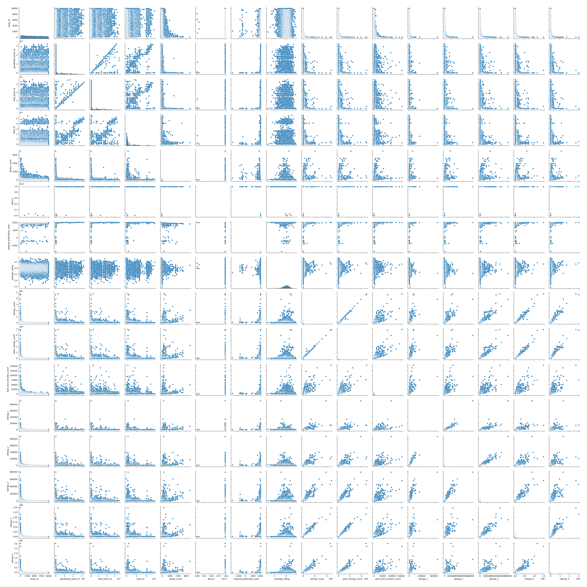
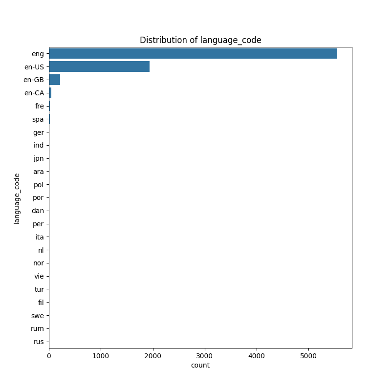

# Automated Data Analysis

## Data Overview
The dataset contains information on 10,000 books, with various attributes such as IDs, publication year, average ratings, and ratings distribution. Here is a summary of the key statistics:

1. **Data Range**: The book IDs range from 1 to 10,000, and corresponding Goodreads and best book IDs vary significantly, indicating a wide scope of book entries.

2. **Publication Year**: The books were originally published between 1750 and 2017, with a mean publication year of approximately 1982.

3. **Ratings**:
   - The average rating is approximately 4.00, with a standard deviation of 0.25, suggesting a generally favorable reception.
   - Ratings count (total number of ratings) ranges from 2,716 to about 4.78 million, with the average around 54,000.
   - Ratings distribution shows that the majority of ratings fall in the 4 to 5-star range, suggesting positive feedback overall.

4. **Text Reviews**: There are around 2,920 average text reviews per book, highlighting a substantial level of engagement from readers.

5. **Missing Data**: Certain fields have missing values, notably:
   - ISBN and ISBN13 fields have 700 and 585 missing values, respectively.
   - The original publication year has 21 missing entries.
   - Language codes are missing for 1,084 entries.
   - Title fields show 585 missing original titles.

Overall, the dataset provides a comprehensive view of both current readers' reception of the books and historical publication data, while it still has some fields that need to be addressed due to missing values.

## Outlier Detection
The analysis presents summary statistics for various book-related metrics, including quartiles (Q1, Q3), interquartile ranges (IQR), minimum, and maximum values. 

1. **Book IDs**: The metrics - including book_id, goodreads_book_id, best_book_id, and work_id - show substantial variability, with negative minimum values indicating possible errors or outliers. The IQRs are notably wide, suggesting significant spread in the data.

2. **Book Counts and ISBN**: The `books_count` variable has a Q1 value of 27 and a maximum of 139. The `isbn13` data shows a narrow range but varying minimum values, potentially indicating data entry inconsistencies.

3. **Publication Year**: The `original_publication_year` spans from approximately 1958 to 2042, indicating the inclusion of both historical and futuristic publications.

4. **Rating Metrics**: Average ratings are tightly clustered with a low IQR, indicating most ratings are close to the median. Ratings counts (e.g., `ratings_count`) feature wide ranges and some negative minimum values, suggesting discrepancies or issues in the data collection.

5. **Work Ratings and Reviews**: The `work_ratings_count` and `work_text_reviews_count` have high variability with minimum values that are negative, which may require cleaning or further investigation.

In summary, while there are useful insights into the data regarding ratings, publication years, and book counts, the presence of negative minimums and wide interquartile ranges in several metrics indicates the necessity for data verification and cleaning before further analysis or reporting.

## Correlation Matrix
The correlation matrix presents several key insights regarding the relationships among various attributes of books in the dataset:

1. **Book IDs Correlations**:
   - The book identifiers (`goodreads_book_id`, `best_book_id`, and `work_id`) are highly correlated with each other, with coefficients close to 1 (e.g., `goodreads_book_id` and `best_book_id` at 0.962863). This indicates that these identifiers likely refer to the same sets of books.

2. **Ratings and Reviews**:
   - There are strong positive correlations among the ratings counts (`ratings_count`, `work_ratings_count`, and `work_text_reviews_count`). For instance, `ratings_count` and `work_ratings_count` have a correlation of 0.995099, indicating that books with a higher number of ratings generally also have a higher number of work ratings and reviews.
   - Ratings per individual star rating (e.g., `ratings_1`, `ratings_2`, etc.) also show strong positive correlations with each other, indicating a consistent rating pattern among users.

3. **Impact of Books Count**:
   - The variable `books_count` shows a negative correlation with the total ratings and reviews (e.g., `ratings_count` at 0.332199 and `work_text_reviews_count` at 0.200861). This suggests that an increased count of books may be associated with lower ratings or reviews per book, potentially indicating that as more books are added, individual book performance may dilute.

4. **Publication Year**:
   - The `original_publication_year` has weak correlations with most attributes, indicating that the year of publication does not significantly impact ratings or review counts. However, it shows a moderate negative correlation (-0.319806) with `books_count`, suggesting that older books may be less prevalent compared to newer releases.

5. **Average Ratings**:
   - The `average_rating` does not correlate strongly with most metrics, indicating that average ratings are relatively stable across books irrespective of their popularity or number of ratings. It is slightly positively correlated with higher ratings (particularly `ratings_5` at 0.124142), suggesting that books with higher ratings do receive some degree of higher average scores.

Overall, this analysis reveals intricate relationships among the book attributes, highlighting how identifiers are interconnected, the impact of the number of books on ratings, the consistency in individual user ratings, and varying influences of publication year on book performance metrics.

## Numerical Visualization

## Categorical Visualization

## Final Story
The dataset analyzed encompasses 10,000 books, revealing valuable insights into their publication history, reader reception, and engagement metrics. Spanning from publications as early as 1750 to recent entries up to 2017, the average publication year is approximately 1982, providing a rich historical perspective.

A key finding is the overall positive reception of the books, with an average rating hovering around 4.00 and a significant focus on ratings in the 4 to 5-star range. This suggests that readers largely favor the titles included in the dataset, as indicated by an average of around 54,000 total ratings per book and nearly 2,920 text reviews, showcasing substantial engagement with the material.

However, the dataset is not without its challenges, including notable occurrences of missing values in essential fields like ISBN numbers and language codes, as well as discrepancies represented by negative minimum values in certain metrics such as ratings counts. Such issues indicate the need for data verification and cleaning before any further analysis can be credibly conducted.

On examining outliers and correlations within the data, it’s evident that book identifiers are highly correlated, suggesting consistent classification across metrics. Additionally, there is a robust relationship between ratings counts and reviews, affirming that books with higher engagement tend to receive more feedback. Conversely, an increased count of books seems associated with a decline in individual ratings and reviews per title, indicating potential dilution of performance as the dataset expands.

The year of publication shows weak correlation with ratings and reviews, but a moderate negative correlation with the total book count, suggesting that older works are less represented in the total offerings. Importantly, average ratings demonstrate stability across the dataset, with only slight positive correlations to specific high ratings.

In conclusion, this analysis presents a comprehensive understanding of the book dataset, revealing favorable reader responses while highlighting areas that require attention regarding data integrity. Visualizations of numerical and categorical data have been created, providing concrete representations of these findings. The story encapsulated here not only paints a picture of reader preferences but also underscores the importance of meticulous data management in literary analysis.

