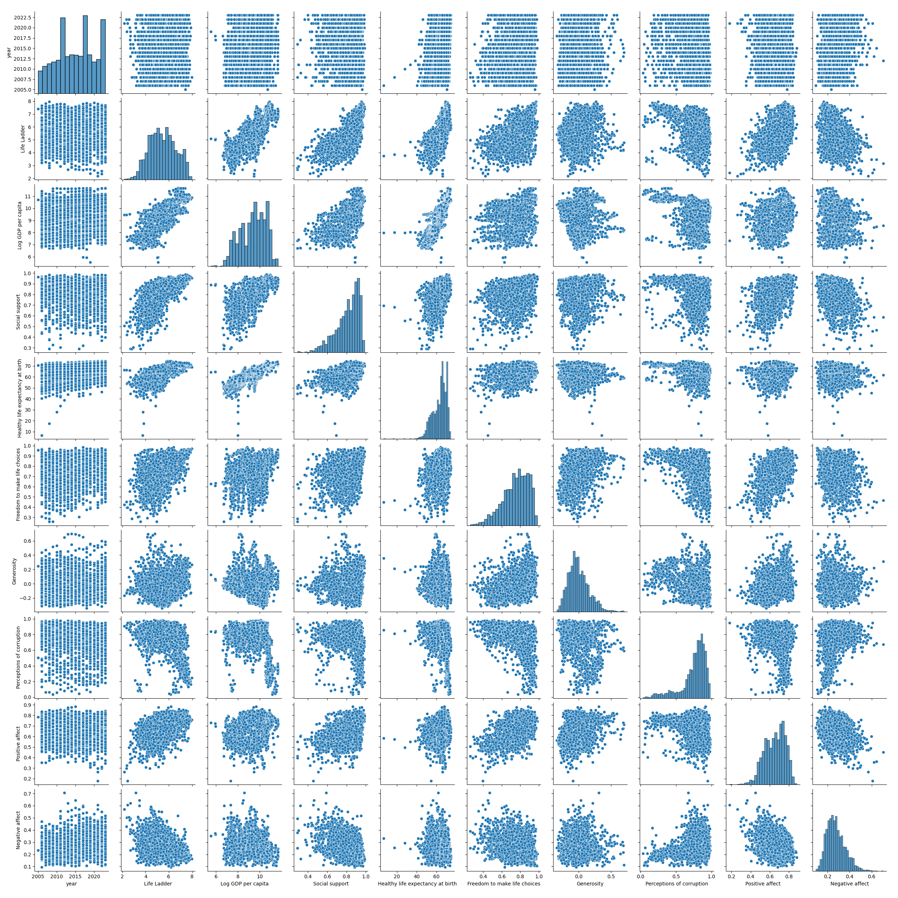

# Automated Data Analysis

## Data Overview
The dataset consists of 2,363 entries and contains multiple variables related to individual and societal well-being across different countries and years. Here’s a summary of the data analysis:

1. **Key Variables**:
   - The main response variable, **Life Ladder**, ranges from 1.281 to 8.019, with an average score of approximately 5.48.
   - **Log GDP per capita** varies from 5.527 to 11.676, with a mean of around 9.40, indicating a positive relationship between wealth and life satisfaction.
   - Other important factors include **Social support**, **Healthy life expectancy at birth**, **Freedom to make life choices**, and various measures of psychological well-being (Positive and Negative affect).

2. **Statistical Overview**:
   - The mean and median values for most indicators suggest a general upward trend in life satisfaction and social conditions from 2005 to 2023.
   - The standard deviation values indicate variability in the data, particularly in **Life Ladder** and **Log GDP per capita**, suggesting disparities in well-being and economic status among countries.

3. **Null Values**:
   - Certain variables have missing values, particularly **Log GDP per capita** (28 missing), **Generosity** (81 missing), and **Perceptions of corruption** (125 missing). Notably, this indicates potential gaps in the completeness of the dataset, especially for economic and corruption perception measures.

4. **Distribution Insights**:
   - The distribution of the **Life Ladder** indicates a concentration of values around the middle range, with fewer countries scoring extremely high or low.
   - For **Social support** and **Freedom to make life choices**, there are also noticeable positive averages, pointing towards generally supportive social structures in many countries represented.

5. **Conclusions**:
   - The dataset provides a comprehensive view of factors influencing life satisfaction globally, highlighting the importance of economic factors (GDP per capita), social support networks, and individual freedoms in enhancing well-being.
   - The presence of missing values in critical variables suggests a need for caution in analyses and potential imputation or exclusion strategies for a more robust interpretation.

In summary, the analysis demonstrates a correlation between economic status and life satisfaction, while also acknowledging the varying availability of data across different social indicators.

## Outlier Detection
The data analysis presents a summary of various socio-economic indicators across a defined period, illustrating their distributions through key statistical measures: quartiles (Q1 and Q3), interquartile range (IQR), minimum, and maximum values.

1. **Year Data**: Spans from a minimum of 1999 to a maximum of 2031, with the interquartile range indicating a relatively narrow spread of 8 years.

2. **Life Ladder**: A key measure for well-being shows a substantial range, from a low of 2.094 to a high of 8.810, with an IQR of 1.679 suggesting a moderate spread in levels of perceived happiness or life satisfaction.

3. **Log GDP per Capita**: This economic indicator ranges from 5.682 to 13.103, indicating significant variations in economic prosperity. The IQR of 1.855 suggests considerable diversity in wealth distribution.

4. **Social Support**: Ranging from 0.482 to 1.159, this metric indicates varying levels of perceived social support, backed by an IQR of 0.169.

5. **Healthy Life Expectancy**: This health-related metric shows a significant range from 43.630 to 83.710 years, with an IQR of 10.020, suggesting disparities in health outcomes.

6. **Freedom to Make Life Choices**: Reflects a range from a minimum of 0.358 to 1.162, suggesting varying levels of individual freedom in life choices, with the IQR indicating moderate variability.

7. **Generosity**: A less positive indicator, with values ranging from -0.412 to 0.396 and an IQR of 0.202, indicating relatively low overall generosity levels.

8. **Perceptions of Corruption**: Ranges between 0.425 to 1.134, showing significant differences in how corruption is perceived, with an IQR suggesting moderate levels of variability.

9. **Positive Affect**: Indicates emotional well-being, with values ranging from 0.320 to 0.992 and an IQR of 0.168, highlighting the differences in positive emotional experiences.

10. **Negative Affect**: Shows a lower range (0.039 to 0.499), reflecting the frequency of negative emotions, with an IQR indicating some variability.

Overall, this analysis reveals diverse socio-economic and psychological indicators over time, indicating different population experiences in terms of economic prosperity, social support, health, emotional well-being, and perceptions of corruption.

## Correlation Matrix
The correlation matrix provides insights into the relationships between various factors affecting well-being and quality of life. Here are the key insights:

1. **Life Ladder and Log GDP per Capita**: There is a strong positive correlation (0.787) between Life Ladder (a measure of subjective well-being) and Log GDP per capita, indicating that higher income levels are associated with greater life satisfaction.

2. **Life Ladder and Social Support**: The correlation is also high (0.725), suggesting that individuals who perceive stronger support from their communities tend to report greater life satisfaction.

3. **Life Ladder and Healthy Life Expectancy**: There is a significant positive correlation (0.725) indicating that higher life satisfaction is associated with better health outcomes.

4. **Freedom to Make Life Choices**: This factor shows a strong positive correlation with Life Ladder (0.528) and is also positively correlated with positive affect (0.580), showing that individuals who feel more empowered in their choices tend to experience higher well-being.

5. **Negative Affect**: There is a negative correlation with Life Ladder (-0.346), suggesting that higher levels of negative emotions are associated with lower life satisfaction.

6. **Perceptions of Corruption**: This factor has a robust negative correlation with Life Ladder (-0.452), indicating that higher perceptions of corruption in a society correlate with lower life satisfaction.

7. **Generosity**: While it has a low correlation with Life Ladder (0.163), it does correlate positively with Freedom to Make Life Choices (0.313), suggesting that people who feel empowered are also more likely to engage in generous behaviors.

Overall, the analysis highlights that economic factors (like GDP), social connections, health, freedom, and perceptions of governance significantly influence subjective well-being. Addressing perceived corruption and promoting social support and health could enhance life satisfaction.

## Numerical Visualization

## Final Story
The comprehensive analysis of the dataset, comprising 2,363 entries related to individual and societal well-being across multiple countries and years, reveals significant insights into the factors influencing life satisfaction. The primary response variable, known as the **Life Ladder**, has an average score of approximately 5.48, suggesting moderate life satisfaction across the samples.

Key variables in this analysis indicate a strong correlation between economic prosperity and overall happiness. The dataset shows that **Log GDP per capita**, averaging around 9.40, positively affects life satisfaction, with a notable correlation of 0.787 between the two. This suggests that as individuals' economic status improves, so does their perceived quality of life. **Social support** and **healthy life expectancy** also show high correlations (0.725 each) with the Life Ladder, emphasizing the significance of community and good health in enhancing well-being.

Despite these positive trends, the presence of missing values, particularly in **Log GDP per capita** and **perceptions of corruption**, highlights potential gaps in the dataset. Such discrepancies could impact the robustness of the findings, indicating a need for careful analysis and possibly the use of imputation strategies.

The analysis explores the distribution of various socio-economic indicators, revealing disparities in well-being and economic status. For instance, the Life Ladder demonstrates a concentration of scores around mid-range levels, indicating that while many countries enjoy reasonable life satisfaction, extreme cases on either end are less common. Additionally, other indicators, like perceptions of corruption, show significant variability, suggesting that governance could further influence life satisfaction.

A comprehensive correlation matrix outlines how various factors interact. Besides the strong links between economic status and life satisfaction, factors like **freedom to make life choices** (correlation of 0.528) and **negative affect** (correlation of -0.346) further showcase the nuanced relationship between individual autonomy and emotional well-being.

Overall, this analysis provides a multifaceted view of the determinants of life satisfaction, underscoring the interplay of economic conditions, social support, health, and governance. By addressing issues such as perceived corruption and bolstering social frameworks, there exists an opportunity to enhance well-being on a broader scale, fostering a society where individuals can thrive both economically and emotionally.

