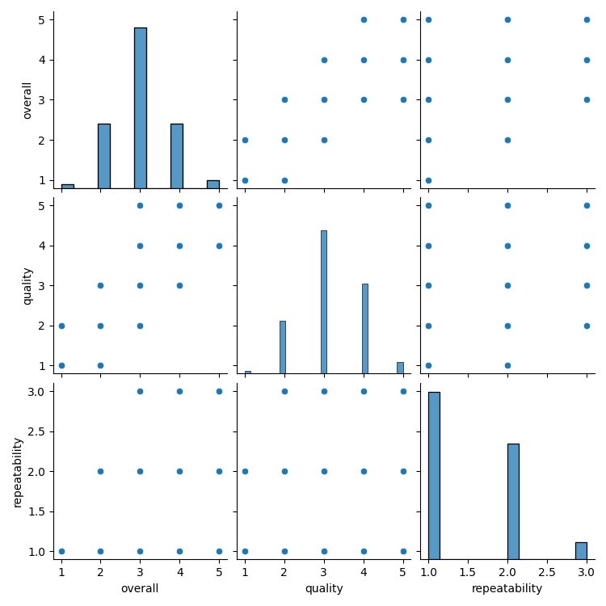
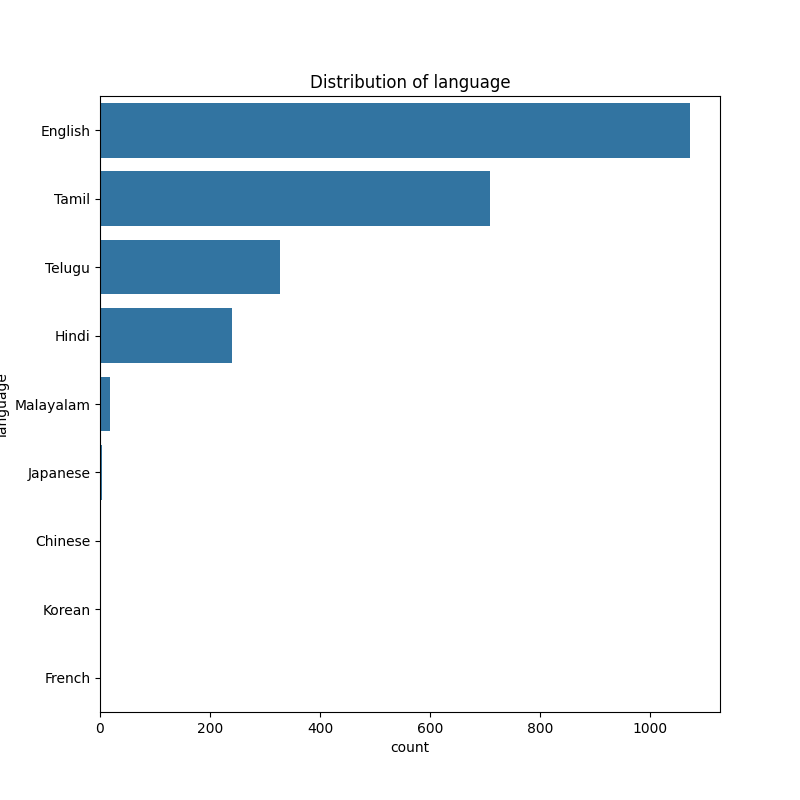

# Automated Data Analysis

## Data Overview
The data analysis summarizes a dataset containing 2,652 entries across several variables: overall satisfaction, quality, and repeatability. 

Key statistics are as follows:

- **Overall Satisfaction**: 
  - Mean: 3.05
  - Standard Deviation: 0.76
  - Median: 3.00
  - Range: 1.00 (min) to 5.00 (max)
  - 75th Percentile: 3.00
  
- **Quality**:
  - Mean: 3.21
  - Standard Deviation: 0.80
  - Median: 3.00
  - Range: 1.00 (min) to 5.00 (max)
  - 75th Percentile: 4.00
  
- **Repeatability**:
  - Mean: 1.49
  - Standard Deviation: 0.60
  - Median: 1.00
  - Range: 1.00 (min) to 3.00 (max)
  - 75th Percentile: 2.00

There are missing values in the dataset:
- For the 'date' variable, there are 99 missing entries.
- The 'by' field has 262 missing entries.
- All other variables do not have any null values.

Overall, the data indicates that responses fall mainly within the lower to middle range of the scores given, particularly for overall satisfaction and quality, while repeatability scores are lower on average.

## Outlier Detection
The data analysis provides an overview of three key metrics: overall performance, quality, and repeatability.

1. **Overall**: 
   - The first quartile (Q1) and third quartile (Q3) are both 3.0, resulting in an interquartile range (IQR) of 0.0, indicating no variability in this metric. 
   - The minimum and maximum values are both 3.0, suggesting that all observations in this category are identical.

2. **Quality**: 
   - The Q1 is 3.0 and the Q3 is 4.0, leading to an IQR of 1.0, which shows some variability in this metric.
   - The range of quality scores is from a minimum of 1.5 to a maximum of 5.5, indicating a broader distribution of quality ratings.

3. **Repeatability**: 
   - The Q1 is 1.0 and the Q3 is 2.0, resulting in an IQR of 1.0, reflecting variability in repeatability as well.
   - The scores range from a minimum of -0.5 to a maximum of 3.5, suggesting there are instances of poor repeatability.

Overall, the data indicates uniformity in the overall performance, moderate variation in quality, and significant variability in repeatability.

## Correlation Matrix
The correlation matrix presents the relationships among three variables: overall, quality, and repeatability. Key insights from the data analysis are:

1. **Strong Correlation between Overall and Quality**: There is a strong positive correlation (0.825) between the overall measurement and quality. This suggests that as the quality improves, the overall scores also tend to increase significantly.

2. **Moderate Correlation between Overall and Repeatability**: The correlation between overall and repeatability is moderate (0.523). This indicates that while there is a positive relationship, it is not as strong as that between overall and quality, suggesting that repeatability has a lesser impact on the overall measurement.

3. **Weak Correlation between Quality and Repeatability**: The correlation between quality and repeatability is relatively weak (0.313). This shows that changes in quality are not strongly linked to changes in repeatability, indicating they may be influenced by different factors.

Overall, the analysis indicates a clear relationship among the variables, with quality being a significant predictor of overall performance, while repeatability appears to have a more limited direct effect.

## Numerical Visualization

## Categorical Visualization

## Final Story
The data analysis involves a thorough examination of a dataset containing 2,652 entries, focusing on three primary variables: overall satisfaction, quality, and repeatability. 

### Key Findings
1. **Satisfaction and Quality**: The overall satisfaction, with a mean score of 3.05 and quality mean of 3.21, reveals that most responses cluster in the lower to middle range of scores. This indicates a tendency for participants to express moderate levels of satisfaction and quality perception. 

2. **Repeatability Concerns**: Unlike satisfaction and quality, repeatability scored lower on average, with a mean of just 1.49. The scores suggest considerable issues with repeatability, as indicated by a median score of 1.00 and a range from 1.00 to 3.00.

3. **Outlier Detection**: An examination of quartiles reveals uniformity in overall satisfaction scores, with all observations rated at 3.0. However, quality scores show some variability, with an interquartile range of 1.0, while repeatability scores exhibit significant variability, with outlier instances of poor performance.

4. **Correlation Insights**: The analysis also points to strong positive correlations, notably 0.825 between overall satisfaction and quality, indicating that improvements in quality tend to lead to higher overall satisfaction. Conversely, the correlation between overall satisfaction and repeatability (0.523) suggests a moderate relationship, while the link between quality and repeatability is noticeably weaker (0.313), indicating that they may be influenced by different factors.

### Conclusion
Overall, the analysis underscores a pivotal relationship among the three variables, with quality being the most significant predictor of overall satisfaction. The substantial issues surrounding repeatability warrant attention, as they could affect the reliability of overall satisfaction and quality ratings. Visualizations of both numerical and categorical data were created to further elucidate these insights, reinforcing the findings that the dataset reflects a landscape of moderate to low satisfaction and quality, compounded by concerns about repeatability.

